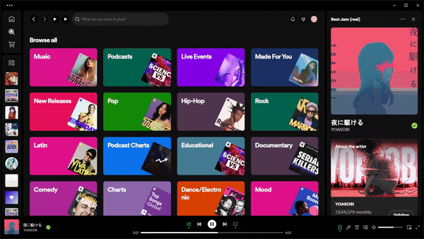
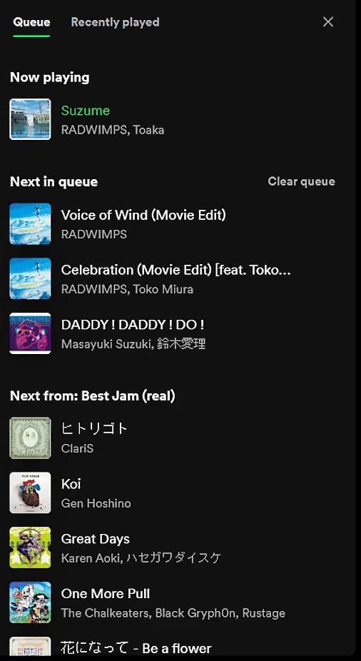

## AutoPlay

Filename: `AutoPlay.js`

An extension that helps you get plays while you pause your song.

- Automatically plays a selected song after you have paused for 5 seconds
- Skips to the next song after 55% completion for Last.FM farming
- Allows toggling of the autoplay and Last.FM farming features

## How to use

Right click the song you want to autoplay in the background and set as Autoplay.


Now the selected song should automatically play when you pause for more than 5 seconds!




## Features

Toggles for extension and Last.FM farming.


Auto skips if you have Last.FM farming on and song goes over 55%.


Saves queue and playlist and adds it back after autoplay.




## Install

Copy `AutoPlay.js` into your [Spicetify](https://github.com/khanhas/spicetify-cli) extensions directory:

| Platform | Path |
| **Windows** | `%userprofile%\AppData\Roaming\spicetify\Extensions` |

After putting the extension file into the correct folder, run the following command to install the extension:

```sh
spicetify config extensions AutoPlay.js
spicetify apply
```

## Uninstall

To uninstall, run the following command:

```sh
spicetify config extensions AutoPlay.js-
spicetify apply
```

You can now delete the file in the extensions folder.
